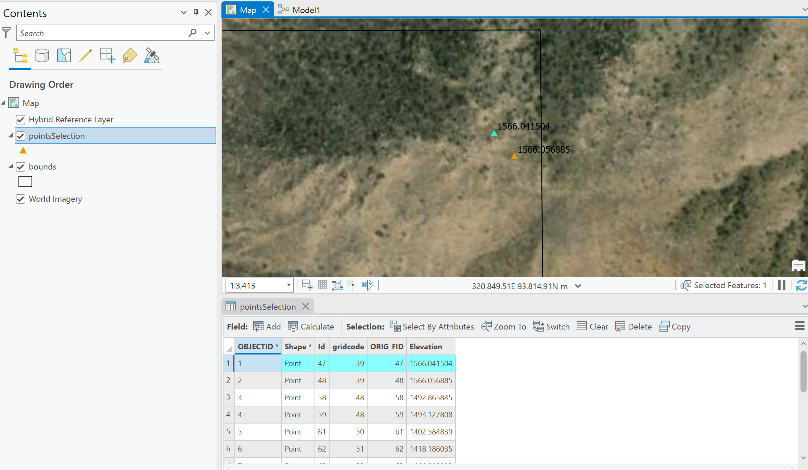

After successfully running your script, you should get an output that will tell you the raster output from the point that has the highest visibility, as well as the number of raster cells that are visible from that point. 

The number in the name of your raster, (3 in this example), corresponds to the point number in your pointsSelection feature class. 

To find the coordinates of this point, open your pointsSelection feature class within your environment. You can do this by right clicking and selecting 'Open Table', and dragging the feature class on to your map.

Then, find the 'OBJECTID' field number that corresponds to your result. You can select this point in the table to view it on the map. You can also use the 'zoom to' tool to zoom to the point you are looking for.

Once the point is selected, you can view its coordinates in the status bar at the bottom of the ArcGIS Pro window. The coordinates will be displayed in the format of the map projection being used (e.g., decimal degrees, UTM, etc.). 

